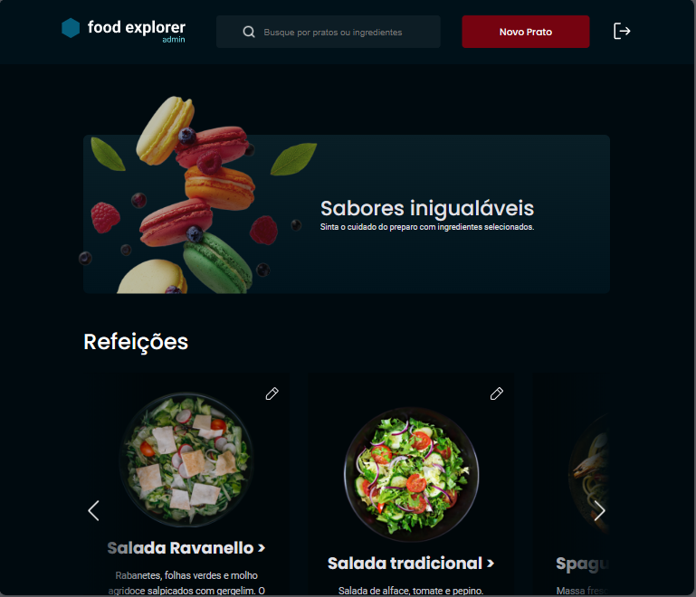
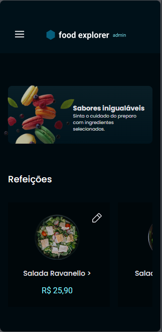

# Food Explorer - Back-end 🥗⚙

<p align="center" style='padding-top: 20px'>
  <a href="#about">Sobre o projeto/ About the project 📁</a>&nbsp;&nbsp;&nbsp;|&nbsp;&nbsp;&nbsp;
  <a href="#structure">Estrutura/ Structure ⚙</a>&nbsp;&nbsp;&nbsp;|&nbsp;&nbsp;&nbsp;
  <a href="#technologies">Tecnologias/ Technologies 🛠</a>&nbsp;&nbsp;&nbsp;|&nbsp;&nbsp;&nbsp;
  <a href="#usage">Utilização/ How to use 💡</a>&nbsp;&nbsp;&nbsp;|&nbsp;&nbsp;&nbsp;
  <a href="#license">Licença/ License 📃</a>
</p>

<div style='display: flex; justify-content: center; gap: 100px; padding: 20px 0px;'>


</div>

<h2 id='about'>Sobre o projeto/ About the project 📁</h2>

<div style='display: flex; align-items: center; gap: 10px' >

PT-BR:
</div>
Aplicação que simula um cardápio de um restaurante, onde duas personas podem acessar, um admin e um cliente.

Este reposiório é referente ao back-end do projeto, o front-end pode ser acessado no seguinte repositório: [🔗 Front-end repository](https://github.com/tkoch97/food-explorer-front)

<div style='display: flex; align-items: center; gap: 10px' >

EN:
</div>
Application that simulates a restaurant menu, where two personas can access, an admin and a client.

This repository refers to the back-end of the project, the front-end can be accessed in the following repository: [🔗 Front-end repository](https://github.com/tkoch97/food-explorer-front)

<h2 id='structure'>Estrutura/ Structure ⚙</h2>

O projeto é composto pelas seguintes tabelas:/
This project is composed of the following tables:

- Usuários/ Users
- Pratos/ Dishes
- Ingredientes/ Ingredients

<h2 id='technologies'>Tecnologias/ Technologies 🛠</h2>

Tecnologias que compõem essa aplicação/
Technologies of this application:

- BCrypt
- Cookie-parser
- CORS
- DotEnv
- Express
- Express-async-errors
- Json Web Token
- Knex
- Multer
- Pm2
- SQLite

<h2 id='usage' >Como usar/ How to use 💡</h2>

<div style='display: flex; align-items: center; gap: 10px' >

PT-BR:
</div>

A aplicação está disponível para uso [aqui](https://food-explorer-front-eosin.vercel.app/), Front-end do projeto consumindo esta API.

Você também pode executá-la em sua máquina localmente. Certifique-se de ter o ``Node.js`` e o ``npm`` instalados antes de prosseguir com as etapas abaixo:

<div style='display: flex; align-items: center; gap: 10px' >

EN:
</div>

The application is avaiable to use [here](https://food-explorer-front-eosin.vercel.app/). Front-end of the project consuming this API. 

You can also run it on your local machine. Make sure you have ``Node.js`` and ``npm`` installed before proceeding with the steps below


1. Clone o projeto/ clone the project:

```
$ git clone https://github.com/tkoch97/food-explorer-api.git
```

2. Acesse a pasta do projeto/ access the project's folder:

```
$ cd food-explorer-api
```

3. Instale as dependências/ Install dependencies:

```
$ npm install
```

4. Abra o projeto no editor de código-fonte, se você utiliza o VSCode, digite o comando/ Open the project on the source code editor, if you use the VSCode, type this comand:

```
$ code .
```

5. Crie um arquivo .env segindo a padrão do arquivo ".env.example" e preencha os campos AUTH_SECRET e SERVER_PORT./ Create a .env file following default way of file ".env.example":

```
AUTH_SECRET=
SERVER_PORT=
```
6. Execute as migrações para criar as tabelas no banco de dados/ Execute the migrates for create tables on data base:

```
$ npm run migrate
```

7. Execute a seed para criar o usuário admin no banco de dados/ Execute the seed for create user admin on data base:

```
$ npm run seed
```

8. Inicie o servidor/ Init server:

```
$ npm run dev
```

<h2 id="license">📝 Licença</h2>

Este projeto está sob a licença MIT./ This project is licensed by MIT.
<p>
  
</p>